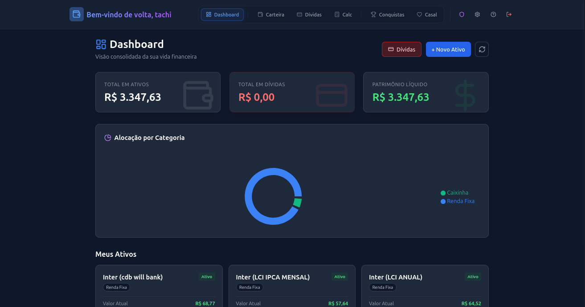
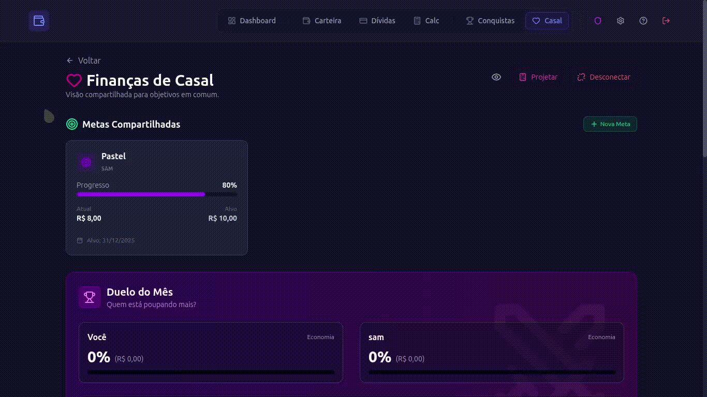
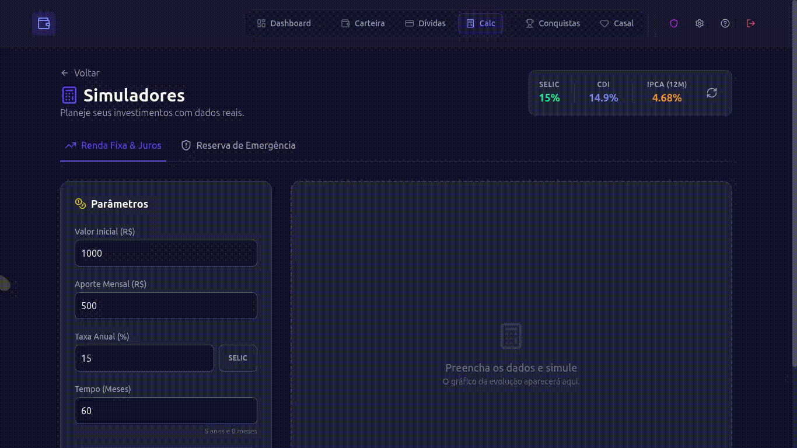

<div align="center">

# 💰 Personal Finance Manager

**Um sistema completo para gestão de patrimônio pessoal, focado no cálculo real de rentabilidade, controle de dívidas e fluxo de caixa inteligente.**


</div>

---

## 📚 Documentação

Antes de começar, confira os guias detalhados do sistema:

- 📖 **[Guia do Usuário](docs/USER_GUIDE.md)**: Como usar o Dashboard, Bot Telegram e Recursos de Casal.
- 🏗️ **[Arquitetura do Sistema](docs/ARCHITECTURE.md)**: Detalhes técnicos, stack e modelagem de dados.
- 📡 **[Referência da API](docs/API_REFERENCE.md)**: Visão geral dos endpoints do Backend.
- 🏠 **[Configuração HomeLab](docs/DEPLOY_HOMELAB.md)**: Detalhes específicos sobre o deploy no Acer i3 com Tailscale.

---

## 📖 Sobre o Projeto

Diferente de planilhas comuns, este sistema utiliza **lógica FIFO** para cálculo preciso de impostos em Renda Fixa e integrações com APIs externas para Renda Variável. O objetivo é oferecer uma visão clara de **Ativos vs. Passivos** para calcular o Patrimônio Líquido real, além de automatizar o registro de despesas diárias.

### 📸 Screenshots

<div align="center">

</div>

---

## ✨ Funcionalidades Principais

### 💸 Fluxo de Caixa Inteligente

- **Bot Telegram Integrado:** Registre gastos em tempo real enviando uma mensagem simples (ex: `15.50 Almoço`). O sistema identifica valor, descrição e categoriza automaticamente.
- **Importação de OFX,CSV e PDF:** Carregue extratos bancários e deixe a IA simples categorizar (ex: "McDonalds" -> "Alimentação").
- **Auto-Categorização:** Algoritmo que aprende com descrições passadas para organizar suas finanças sem intervenção manual.

### ❤️ Finanças de Casal

- **Visão Combinada:** Visualize a soma dos patrimônios.
- **Acerto de Contas:** Marque despesas como "Compartilhadas" e o sistema calcula automaticamente a divisão justa (Splitwise integrado), mostrando quem deve a quem no final do mês.
- **Gráficos de Contribuição:** Veja quem investiu mais proporcionalmente no período.

<div align="center">

</div>

### 💼 Gestão de Investimentos & Gamificação

- **Renda Fixa:** Cálculo automático de impostos regressivos e atualização diária pelo CDI.
- **Renda Variável:** Cotações automáticas de Ações, FIIs e Criptomoedas (CoinGecko/Yahoo Finance).
- **Gamificação:** Ganhe medalhas (Badges) e suba de nível ("Novato" a "Lenda dos Dividendos") conforme melhora sua saúde financeira e poupa mais.

<div align="center">

</div>

### 🤖 Automação de Backend

- **Scheduler Integrado:** Tarefas automáticas às 09:00 e 18:00.
- **Auto-Correção do CDI:** Monitora o Banco Central e atualiza a taxa Selic globalmente.
- **Snapshots:** Gera histórico diário do patrimônio para gráficos de evolução.

### 🧮 Calculadoras Financeiras

- Juros Compostos vs. Simples.
- Comparador CDB vs LCI/LCA (Isento de IR).
- Projeção de Independência Financeira.

---

## 🚀 Tecnologias Utilizadas

### Backend

| Tech                      | Descrição                                       |
| :------------------------ | :---------------------------------------------- |
| **Python 3.12 + FastAPI** | Performance assíncrona e tipagem forte.         |
| **APScheduler**           | Agendamento de tarefas complexas em background. |
| **Python-Telegram-Bot**   | Interface de chat para registro rápido.         |
| **SQLAlchemy**            | ORM robusto para banco de dados SQLite.         |
| **Pandas / Numpy**        | Cálculos financeiros vetorizados.               |

### Frontend

| Tech                | Descrição                                        |
| :------------------ | :----------------------------------------------- |
| **React 19 + Vite** | Interface reativa, rápida e moderna.             |
| **TailwindCSS**     | Estilização responsiva com **Dark Mode** nativo. |
| **Recharts**        | Biblioteca de gráficos customizáveis.            |

---

## 🛠️ Como Rodar o Projeto

### Pré-requisitos

- [Docker](https://www.docker.com/) e Docker Compose instalados.

### 🐳 Rodando com Docker (Recomendado)

1.  **Clone o repositório:**

    ```bash
    git clone https://github.com/OnlyTachi/personal-finance-manager.git
    cd personal-finance-manager
    ```

2.  **Configure o Ambiente:**
    Crie um arquivo `.env` na pasta `backend/` (opcional para o bot):

    ```env
    TELEGRAM_BOT_TOKEN=seu_token_aqui
    ```

3.  **Execute o container:**

    ```bash
    docker-compose up --build
    ```

4.  **Acesse a aplicação:**
    - 📱 Frontend: `http://localhost:5173`
    - ⚙️ API Docs: `http://localhost:8000/docs`

### Instalação Manual (Dev)

#### Backend

```bash
cd backend
python -m venv venv
# Windows: venv\Scripts\activate | Linux/Mac: source venv/bin/activate
pip install -r requirements.txt
uvicorn app.main:app --reload
```

#### Frontend

```bash
cd frontend
npm install
npm run dev
```

---

## 🛡️ Segurança

> [!WARNING] 
> Atenção: Este projeto foi desenvolvido para uso pessoal local.

A chave de criptografia (`SECRET_KEY`) presente nos arquivos de configuração padrão deve ser alterada imediatamente caso você pretenda fazer o deploy em um ambiente de produção ou exposto à internet.

---

## 📝 Licença

Este projeto está sob a licença MIT. Consulte o arquivo [LICENSE](./LICENSE) para mais detalhes.

<div align="center">
Feito com 💜 por OnlyTachi
</div>
